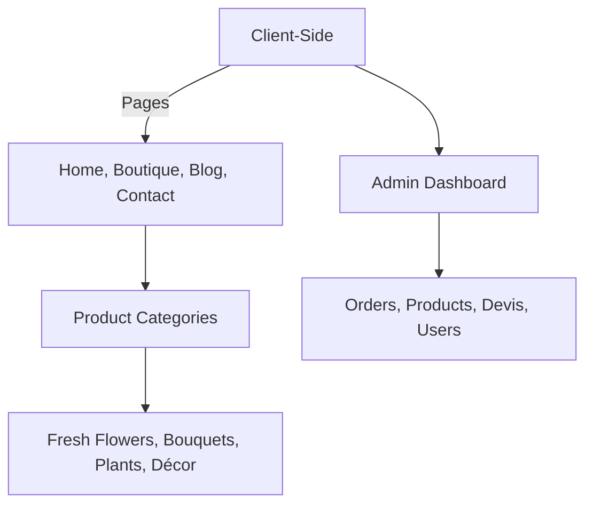

# ChezFlora 🌸  
*Modern e-commerce platform for floral decoration and event services*


---

## Project Overview  
ChezFlora is a web application designed to modernize floral decoration and event services. It enables clients to shop, request quotes for custom services, and engage with the brand through a blog, while administrators manage inventory, orders, and promotions seamlessly. Built with modern technologies like React, Express.js, and PostgreSQL, the platform prioritizes security, user experience, and scalability.

---

## Key Features  

### Client-Side Features
- **E-Commerce Experience**  
  - Dynamic product catalog with5000 categories (fresh flowers, bouquets, plants, decor items)  
  - Customizable cart with real-time updates  
  - Secure checkout with payment integration (to be added)  

- **Service Management**  
  - Quote request system for event decoration (e.g., weddings, corporate events)  
  - Devis generation and confirmation workflow  

- **Engagement Tools**  
  - Blog with categorized articles (flower care, trends, gift ideas)  
  - User accounts with order history, delivery tracking, and profile management  

### Admin-Side Features
- **Inventory & Product Management**  
  - CRUD operations for products, categories, and promotions  
  - Low-stock alerts and automated email notifications  

- **Order & Quote Tracking**  
  - Real-time order status updates (preparation, delivery, etc.)  
  - Devis management (view, respond, confirm)  

- **Content & User Control**  
  - Blog post scheduling and moderation  
  - User account management (banning, deletion)  
  - Site-wide settings (slogan, "About Us" updates)

---

## Design System  
ChezFlora’s design reflects nature, elegance, and simplicity.

**Color Palette:**  
- Primary: Soft Green (`#B2DFDB`)  
- Secondary: Pale Pink (`#F8BBD0`), Beige (`#F5F5DC`)  
- Accent: Warm Brown (`#75472A`)

**Typography:**  
- **Titles:** Handwritten font (e.g., *Great Vibes*) for an artisanal touch  
- **Body Text:** Modern sans-serif (e.g., *Roboto*) for readability

**Visual Elements:**  
- Floral motifs in backgrounds and buttons  
- High-quality product images with lightbox previews

---

## Tech Stack  
**Frontend (Client & Admin):**  
- React.js (with TypeScript)  
- Tailwind CSS (for responsive design)  
- Redux Toolkit (state management)  
- React Router (navigation)

**Backend:**  
- Node.js with Express.js  
- MongoDB (ORM: Prisma)  
- JWT Authentication (with cookie-based sessions)
- Nodemailer & express handlebars

**CMS & Tools:**  
- Swagger/OpenAPI for API documentation  
- Docker for containerization  
- PM2 for production process management

---

## Installation  
### Prerequisites
- Node.js and npm installed  
- MOngoDb database setup

### Setup Instructions
1. Clone the repository:
   ```bash
   git clone https://github.com/DimitriTedom/ChezFlora.git
   cd ChezFlora
   ```
2. Install dependencies:
   ```bash
   # /client/
   npm install or yarn

   # /Server/
   yarn or npm install
   ```
3. Create a `.env` file in the /Server/ directory and configure the following environment variables:
   ```env
        DATABASE_URL="your_database_connection_string"
        PORT=3000
        JWT_SECRET="your_jwt_secret"
        PAYPAL_CLIENT_ID="your_paypal_client_id"
        PAYPAL_CLIENT_SECRET="your_paypal_client_secret"
        CLOUDINARY_CLOUD_NAME="your_cloudinary_cloud_name"
        CLOUDINARY_API_KEY="your_cloudinary_api_key"
        CLOUDINARY_API_SECRET="your_cloudinary_api_secret"
        SMTP_HOST="your_smtp_host"
        SMTP_PORT=your_smtp_port
        SMTP_USER="your_smtp_user"
        SMTP_PASS="your_smtp_password"
        CLIENT_URL="http://localhost:5173"
        ...as listed in .env.example
   ```
 Some of these variables are used for:
- **JWT_SECRET**: Signing JSON Web Tokens.
- **DATABASE_URL**: Connecting to your MongoDb database.
- **SMTP_HOST, SMTP_PORT, SMTP_USER, SMTP_PASS**: Configuring your SMTP server for sending emails (OTP).
4. Run the development server:
   ```bash
   npm run dev or yarn dev
   ```

---

## API Documentation  
**Key Endpoints**  
| Method | Endpoint              | Description                     |
|--------|-----------------------|---------------------------------|
| POST   | `/api/auth/login`     | User login                      |
| POST   | `/api/devis`          | Submit a quote request          |
| GET    | `/api/admin/products` | List all products (admin)       |
| POST   | `/api/blog/publish`   | Schedule a blog post            |

For complete API details, refer to the [Swagger/OpenAPI documentation](http://localhost:5000/api-docs).

---

## Security  
- HTTPS enforced via Nginx reverse proxy  
- Input validation with Joi (backend)  
- SQL injection protection via Prisma ORM  
- Rate limiting (100 requests/minute)

---

## Site Structure  


---
Below is an example of how you can extend your README to include all the authentication functionalities we’ve implemented (registration, login, forgot password with OTP, OTP verification, and password update). You can simply copy-paste this section into your README file.

## Authentication Functionality

ChezFlora’s authentication system provides secure endpoints for user registration, login, password recovery, and password update using OTP verification. Below are the key functionalities and code examples for each:

### Endpoints Overview

| Method | Endpoint                        | Description                                                       |
| ------ | ------------------------------- | ----------------------------------------------------------------- |
| POST   | `/api/auth/register`            | Registers a new user.                                             |
| POST   | `/api/auth/login`               | Logs in an existing user.                                         |
| POST   | `/api/auth/check-user`          | Verifies if a user exists and sends an OTP to the user’s email.     |
| POST   | `/api/auth/verify-otp`          | Validates the OTP sent to the user’s email.                       |
| POST   | `/api/auth/update-password`     | Updates the user's password after OTP verification.               |
| POST   | `/api/auth/logout`              | Logs out the current user.                                          |
| GET    | `/api/auth/checkauth`           | Checks the authentication status (for protected routes).          |

### Detailed Functionality

#### 1. User Registration
New users can sign up by providing their name, email, and password.  
**Example Request:**
```bash
curl -X POST http://localhost:PORT/api/auth/register \
-H "Content-Type: application/json" \
-d '{"name": "John Doe", "email": "john.doe@example.com", "password": "yourPassword"}'
```
#### 2. User Login
Registered users can log in by providing their email and password.  
**Example Request:**
```bash
curl -X POST http://localhost:PORT/api/auth/login \
-H "Content-Type: application/json" \
-d '{"email": "john.doe@example.com", "password": "yourPassword"}'
```

#### 3. Forgot Password & OTP Generation
When a user forgets their password, they submit their email via the `/api/auth/check-user` endpoint.  
If the user exists, the server:
- Generates a 6-digit OTP.
- Stores the OTP with an expiration time in the database.
- Sends the OTP to the user's email.

**Example Request:**
```bash
curl -X POST http://localhost:PORT/api/auth/check-user \
-H "Content-Type: application/json" \
-d '{"email": "john.doe@example.com"}'
```

#### 4. OTP Verification
After receiving the OTP, the user verifies it by calling the `/api/auth/verify-otp` endpoint with their email and OTP.  
**Example Request:**
```bash
curl -X POST http://localhost:PORT/api/auth/verify-otp \
-H "Content-Type: application/json" \
-d '{"email": "john.doe@example.com", "otp": "123456"}'
```

On successful verification, the user is redirected to the password update page.

#### 5. Update Password
Once the OTP is validated, the user can update their password via the `/api/auth/update-password` endpoint.  
**Example Request:**
```bash
curl -X POST http://localhost:PORT/api/auth/update-password \
-H "Content-Type: application/json" \
-d '{"email": "john.doe@example.com", "password": "newSecurePassword"}'
```


### Workflow Example

1. **User Registration**:  
   The user registers via `/api/auth/register`.

2. **Login**:  
   The user logs in via `/api/auth/login`.

3. **Forgot Password**:  
   If the user forgets their password, they submit their email to `/api/auth/check-user`, which sends them an OTP.

4. **OTP Verification**:  
   The user enters the OTP on the client-side and submits it to `/api/auth/verify-otp`. On success, the client navigates to the password update page with the email in the URL.

5. **Password Update**:  
   Finally, the user updates their password via `/api/auth/update-password`.

## Project Structure

```
ChezFlora/
├── client/
│   ├── .dockerignore
│   ├── .env
│   ├── .gitignore
│   ├── components.json
│   ├── Dockerfile
│   ├── eslint.config.js
│   ├── index.html
│   ├── package-lock.json
│   ├── package.json
│   ├── postcss.config.js
│   ├── README.md
│   ├── tailwind.config.js
│   ├── tsconfig.app.json
│   ├── tsconfig.json
│   ├── tsconfig.node.json
│   ├── vite.config.ts
│   ├── yarn.lock
│   ├── public/
│   ├── src/
│   └── ...
├── Server/
│   ├── .dockerignore
│   ├── .env
│   ├── .eslintignore
│   ├── .eslintrc.json
│   ├── .gitignore
│   ├── .nvmrc
│   ├── .prettierignore
│   ├── .prettierrc
│   ├── DATAFLOW.md
│   ├── docker-compose.yaml
│   ├── Dockerfile
│   ├── eslint.config.mjs
│   ├── package.json
│   ├── README.md
│   ├── tsconfig.json
│   ├── yarn.lock
│   ├── prisma/
│   ├── src/
│   └── ...
├── README.md
└── ...
```

## Contributing  
Contributions are welcome! Please read the [contributing guidelines](CONTRIBUTING.md) before submitting a pull request. Ensure adherence to design and coding standards.

---

## License  
MIT License

---

## Acknowledgments  
- **Tools:** Prisma, React, Express.js  
- **Design Inspiration:**  
  - [Bakker](https://fr-fr.bakker.com/)  
  - [Interflora](https://www.interflora.fr/)  
  - [Aquarelle](https://www.aquarelle.com/)

---

## Support  
Questions? Contact **support@chezflora.com** or join our Discord community.
